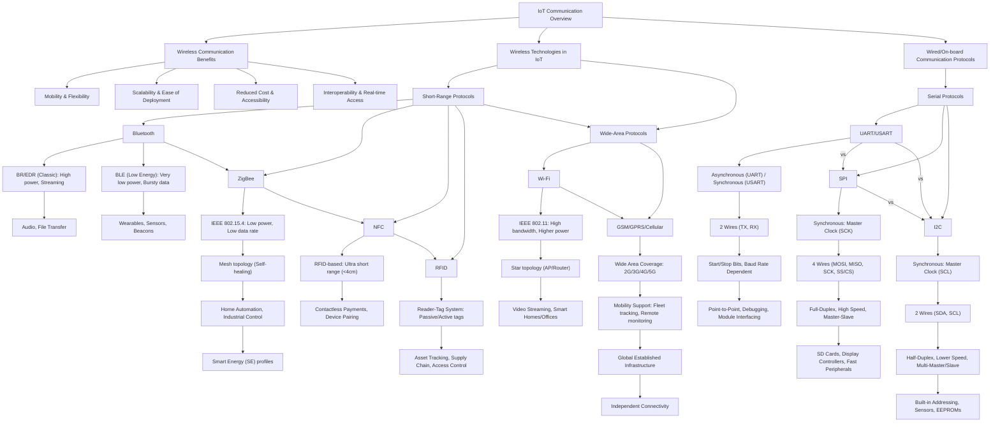
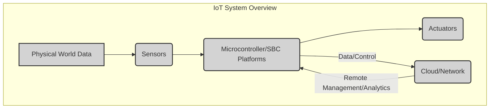
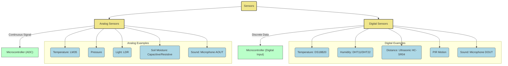
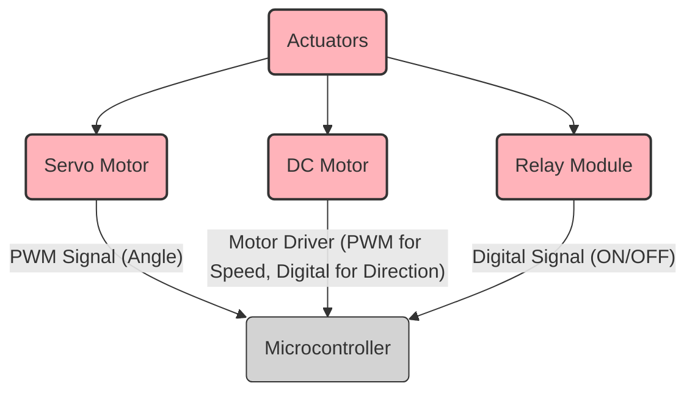
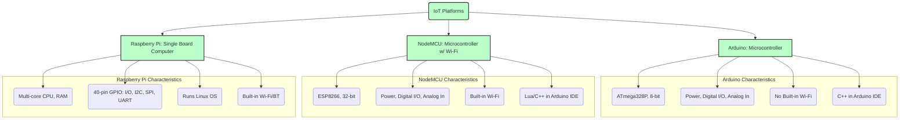

## M2

Here's a summary of the important points from the questions, presented as concise points and interlinked with a Mermaid diagram:

---

### Key Points Summary:

**I. IoT Communication Fundamentals**
*   **Wireless Communication Benefits:**
    *   "Mobility & Flexibility": Essential for diverse IoT device placements.
    *   "Scalability & Ease of Deployment": Simplifies network expansion without extensive cabling.
    *   "Reduced Cost & Accessibility": Lowers installation/maintenance, enables broad reach.
    *   "Interoperability & Real-time Data Access": Standardized protocols allow seamless data exchange and immediate responses.

**II. Wireless Technologies for IoT**

**A. Short-Range Protocols**
*   **Bluetooth:**
    *   "BR/EDR (Classic)": "High power", "Continuous streaming data" ("Audio, File Transfer").
    *   "BLE (Low Energy)": "Very low power", "Intermittent data bursts", "Months/years battery life" ("Wearables, Sensors, Beacons").
*   **ZigBee:**
    *   "IEEE 802.15.4 standard": "Low power", "Low data rate" (20-250 kbps), "Short-range" (75-100m/hop).
    *   "Mesh topology (Self-healing)": "Robust networks" with "Coordinator, Router, End Device roles".
    *   Applications: "Home Automation, Industrial Control, Smart Agriculture", utilizes "Smart Energy (SE) profiles" for utility management.
*   **NFC (Near Field Communication):**
    *   "RFID-based": "Ultra short range" (<4cm), operates at "13.56 MHz".
    *   Modes: "Reader/Writer", "Peer-to-Peer", "Card Emulation".
    *   Applications: "Contactless Payments, Device Pairing", "Smart Posters".
*   **RFID (Radio Frequency Identification):**
    *   "Reader-Tag System": Tags are "Passive or Active", reads "UHF, HF, LF bands".
    *   "Non-line-of-sight" identification.
    *   Applications: "Asset Tracking, Supply Chain Management, Access Control".

**B. Wide-Area Protocols**
*   **Wi-Fi:**
    *   "IEEE 802.11 standard": "High bandwidth", "Higher power consumption".
    *   Operates on "2.4 GHz & 5 GHz bands" with "Mbps to Gbps data rates".
    *   "Star topology (AP/Router)" for local networks.
    *   "WPA/WPA2/WPA3 Security".
    *   Applications: "Video Streaming, Smart Homes/Offices", "Hotspots".
*   **GSM/GPRS/Cellular Networks:**
    *   "Wide Area Coverage": Utilizes "2G/3G/4G/5G" cellular infrastructure.
    *   "Mobility Support": Enables connectivity for moving devices ("Fleet Tracking, Remote Monitoring").
    *   "Global Established Infrastructure" and "Independent Connectivity".
    *   Applications: "Remote Asset Monitoring, Logistics", "Smart City sensors".

**III. Wired/On-board Communication Protocols**

*   **UART/USART (Universal Asynchronous/Synchronous Receiver/Transmitter):**
    *   "Asynchronous (UART)" with "Start/Stop Bits" and "Baud Rate Dependent" synchronization.
    *   "USART" adds "Synchronous" capability.
    *   "2 Wires (TX, RX)" for "Point-to-Point" communication.
    *   Applications: "Debugging", "Interfacing with GPS, GSM, Bluetooth modules".
*   **SPI (Serial Peripheral Interface):**
    *   "Synchronous": Master provides "Clock (SCK)".
    *   "4 Wires (MOSI, MISO, SCK, SS/CS)" per slave.
    *   "Full-Duplex", "High Speed", "Master-Slave" architecture (dedicated "SS/CS" per slave).
    *   Applications: "SD Cards, Display Controllers", "Fast Peripherals".
*   **I2C (Inter-Integrated Circuit):**
    *   "Synchronous": Master provides "Clock (SCL)".
    *   "2 Wires (SDA, SCL)".
    *   "Half-Duplex", "Lower Speed", "Multi-Master/Slave" architecture.
    *   "Built-in Addressing" (7-bit or 10-bit) and "ACK/NACK" for reliability.
    *   Applications: "Sensors (Temp, Humidity, Pressure), EEPROMs", "OLED Displays".

## M3
Here's a summary of the important points from the questions, presented in small points and interlinked with Mermaid diagrams, without repetition.

### 1. Overall IoT System Architecture

At its core, an IoT system involves gathering data from the physical world using sensors, processing that data with platforms like microcontrollers or single-board computers, and then performing actions in the physical world through actuators. Cloud connectivity plays a crucial role for advanced processing, storage, and remote management.

### 2. Sensor Fundamentals

Sensors are devices that detect physical changes in the environment and convert them into electrical signals. They are broadly categorized into analog and digital.

*   **Analog Sensors**:
    *   Produce a continuous output signal (e.g., voltage) proportional to the measured physical quantity.
    *   Offer high theoretical resolution but are susceptible to electrical noise.
    *   Require an Analog-to-Digital Converter (ADC) for processing by digital microcontrollers.
    *   *Typical Pins*: VCC (power), GND (ground), OUT/SIG (analog output).
*   **Digital Sensors**:
    *   Output discrete, binary data (1s and 0s) or structured digital data (e.g., via I2C, SPI, 1-wire protocols).
    *   Less prone to noise and often include internal processing for a clean output.
    *   *Typical Pins*: VCC, GND, DATA (or SDA/SCL for I2C, TX/RX for UART).

### 3. Specific Sensor Operations and Key Pins

Each sensor type measures a unique physical phenomenon:

*   **Temperature Sensor**: Measures heat. Examples include the analog LM35 (output voltage varies with Celsius temperature) and the digital DS18B20 (outputs digital temperature data via a one-wire protocol).
    *   *Typical Pins*: VCC, GND, OUT/DATA.
*   **Humidity Sensor**: Measures water vapor content. Digital sensors like DHT11/DHT22 combine a resistive humidity sensor and a thermistor, sending digital temperature and humidity data over a single line.
    *   *Typical Pins*: VCC, GND, DATA.
*   **Pressure Sensor**: Detects mechanical force in gases or liquids. Converts pressure changes into electrical signals (analog or digital).
    *   *Typical Pins*: VCC, GND, OUT/SDA/SCL.
*   **Soil Moisture Sensor**: Determines water content in soil, often using resistive or capacitive methods where electrical properties change with moisture.
    *   *Typical Pins*: VCC, GND, AOUT/DOUT.
*   **Distance Sensor (Ultrasonic)**: Measures distance by emitting an ultrasonic pulse and calculating the time it takes for the echo to return (Time-of-Flight).
    *   *Typical Pins*: VCC, GND, Trig (send pulse), Echo (receive pulse).
*   **PIR (Passive Infrared) Sensor**: Detects motion (e.g., human presence) by sensing changes in infrared radiation (body heat) within its field of view.
    *   *Typical Pins*: VCC, GND, OUT (digital signal for motion detected).
*   **Light Sensor (LDR)**: Resistance changes with light intensity; higher light means lower resistance.
    *   *Typical Pins*: VCC, GND, OUT (analog voltage).
*   **Sound Sensor (Microphone)**: Converts sound waves into electrical signals. Can provide an analog output for sound level or a digital output for sound detection beyond a threshold.
    *   *Typical Pins*: VCC, GND, AOUT (analog), DOUT (digital).

### 4. Actuator Operations and Key Pins

Actuators are essential for enabling IoT systems to perform physical actions.

*   **Servo Motor**:
    *   **Working**: Provides precise angular or linear positioning. It receives a Pulse Width Modulation (PWM) signal from a microcontroller, compares it to its current position (feedback), and drives a DC motor through a gearbox to achieve the desired angle.
    *   **Typical Pins**: VCC, GND, Signal (PWM input).
    *   **Applications**: Robotic arms, smart blinds, camera pan/tilt, vending machines.
*   **DC Motor**:
    *   **Working**: Converts direct current electrical energy into continuous rotational mechanical energy. Speed is controlled by varying voltage/PWM, and direction is reversed by changing polarity. Often requires a motor driver (e.g., H-bridge) for microcontroller interface due to higher current requirements.
    *   **Typical Pins (via Driver)**: Motor Power, Driver Logic Power, GND, IN1/IN2 (direction), ENA/ENB (speed/PWM).
    *   **Applications**: Smart fans, automated doors/gates, pumps in smart irrigation.
*   **Relay Module**:
    *   **Working**: An electrically operated switch. A low-power control signal energizes an electromagnet, which then opens or closes contacts to control a separate, higher-power (often AC) circuit. Provides electrical isolation.
    *   **Typical Pins**: VCC, GND, IN (control signal), NO (Normally Open), NC (Normally Closed), COM (Common).
    *   **Applications**: Smart lighting, controlling home appliances (e.g., heaters), industrial equipment switching.

### 5. Microcontroller & Single Board Computer (SBC) Platforms

These platforms serve as the "brains" of IoT devices, processing sensor data and controlling actuators.

*   **Arduino (e.g., Uno)**:
    *   **Type**: Microcontroller board (8-bit ATmega328P).
    *   **Key Features**: Open-source, easy to use, significant community support, programmable via Arduino IDE (C++).
    *   **Pin Configuration**: Power (3.3V, 5V, GND, Vin), 14 Digital I/O pins (6 with PWM capability), 6 Analog Input pins, AREF, ICSP header.
    *   **Applications**: Rapid prototyping, basic robotics, physical computing projects, educational purposes.
*   **NodeMCU (e.g., ESP8266-based)**:
    *   **Type**: Microcontroller with integrated Wi-Fi (32-bit ESP8266 SoC).
    *   **Key Features**: Low cost, built-in Wi-Fi connectivity (802.11 b/g/n), larger flash memory, programmable with Lua firmware or Arduino IDE (C++).
    *   **Pin Configuration**: Power (3.3V, 5V, GND, Vin), ~9-10 Digital I/O pins (most supporting PWM, I2C, SPI, UART), 1 Analog Input pin.
    *   **Applications**: IoT projects requiring Wi-Fi (smart home, remote monitoring, cloud data logging), web servers/clients.
*   **Raspberry Pi**:
    *   **Type**: Single Board Computer (SBC).
    *   **Key Features**: More powerful (multi-core CPU, substantial RAM), runs a full operating system (e.g., Linux), integrated Wi-Fi and Bluetooth, HDMI output.
    *   **Pin Configuration (GPIO)**: 40-pin header offering power (3.3V, 5V, GND), general-purpose I/O pins, and dedicated pins for communication protocols like I2C, SPI, and UART.
    *   **Applications**: More complex IoT solutions (edge computing, data processing), robotics, multimedia projects, general-purpose computing.

